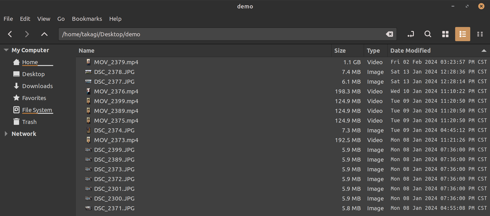
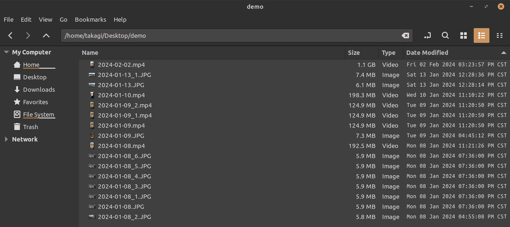

# Datestamp-Renamer
Are you tired of dealing with nonsensical filenames for the photos and videos that document your life's moments?

Introducing DateStampRenamer - a convenient and lightweight solution crafted to simplify file organization by renaming them based on their modified dates.

With DateStampRenamer, effortlessly organize your files with clear, chronological names, enhancing accessibility and clarity in your digital archives.

## Environment 
**Python 3.10.12**, and no additional packages are required. (Earlier versions of Python may also work, this is a fairly simple program)

## Usage
```bash
python3 datestamp_renamer.py --file_dir "path/to/your/dir"
```
Simply execute the script and provide the path to the directory you wish to rename using the `--file_dir` argument. The program will rename all files within the specified directory automatically.

## Demo
### Step 1. Find the path to the directory 
<p align="center">
	
</p>

In this example, the path is `/home/takagi/Desktop/demo`.

### Step 2. Execute the script
```bash
python3 datestamp_renamer.py --file_dir "/home/takagi/Desktop/demo"
```
### Step 3. Savour the tidiness
<p align="center">
	
</p>

It's worth noting that this program also handles datestamp collisions. Feel free to use it with confidence 😎

## Contributing

Pull requests are welcome. For major changes, please open an issue first to discuss what you would like to change.
